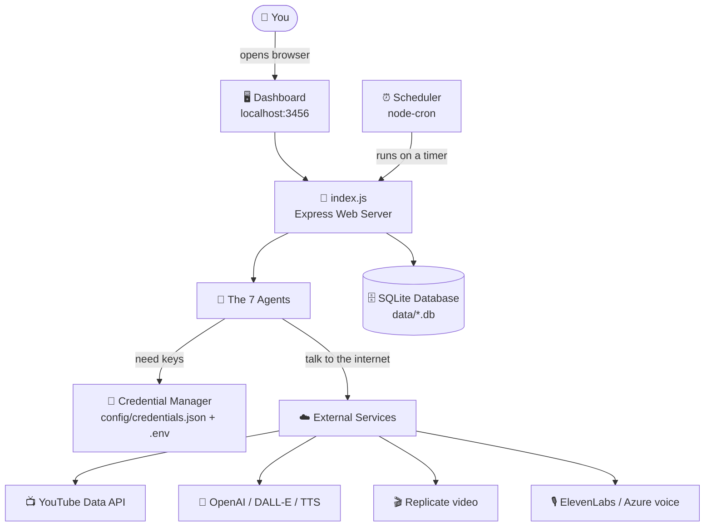
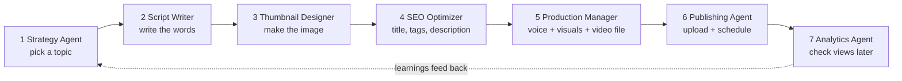
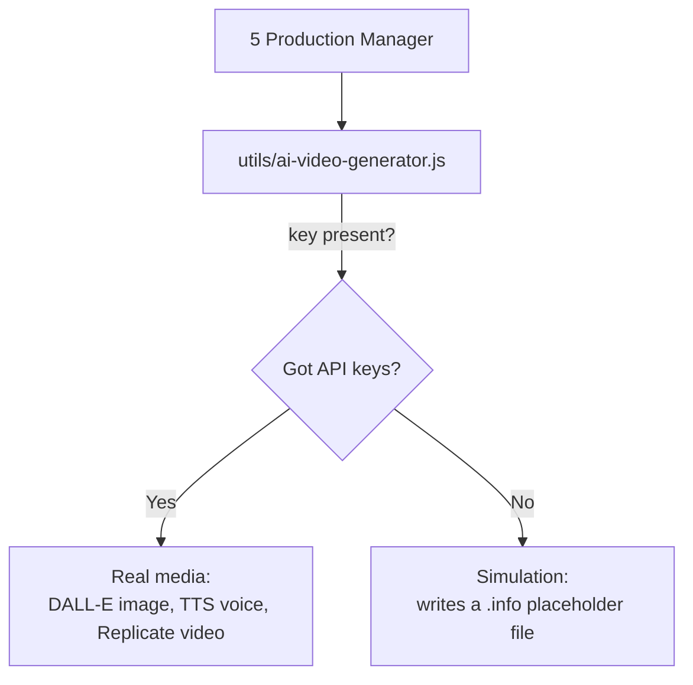

# 🏗️ Architecture Overview (Beginner-Friendly)

This document explains how the **YouTube Automation Agent** is put together,
using simple diagrams. GitHub renders the `mermaid` diagrams below automatically.

---

## 1. The Big Picture



**In plain English:** A small web server (`index.js`) starts up, loads your API
keys, wakes up 7 "agents" (just JavaScript classes), and a timer (cron) tells
them when to do their jobs. Everything they make is stored in a local database
and in the `data/` folder.

---

## 2. How One Video Gets Made (Step by Step)

This is the **content pipeline** — it runs every day at 6:00 AM automatically,
or whenever you click "generate".



| # | Agent | What it actually does |
|---|-------|----------------------|
| 1 | **Content Strategy** | Calls the YouTube API for trending videos, picks a topic using simple scoring rules |
| 2 | **Script Writer** | Fills in **text templates** (hook → intro → body → call-to-action) |
| 3 | **Thumbnail Designer** | Asks DALL-E for an image (or makes a placeholder) |
| 4 | **SEO Optimizer** | Generates title, description, and tags with keyword rules |
| 5 | **Production Manager** | Turns the script into **voice (TTS)**, **images**, and a **video file** (or simulates them) |
| 6 | **Publishing & Scheduling** | Uploads the video to YouTube at the best time |
| 7 | **Analytics & Optimization** | Reads view counts back from YouTube to improve future choices |

---

## 3. Where the "AI" Really Lives

> ⚠️ **Important for beginners:** Most agents use **rules and templates**, not a
> large language model. The only place that calls real AI services is
> `utils/ai-video-generator.js` (images, voice, video). If you don't provide API
> keys, that file falls back to **"simulation" mode** and writes small `.info`
> placeholder files instead of real media — which is exactly what you see in the
> `data/` folder right now.



---

## 4. Folder Map

```
youtube-automation-agent/
├── index.js              ⭐ Start here — web server + wiring
├── setup.js              🧙 Setup wizard (asks for keys)
├── agents/               🤖 The 7 agents (the "brains")
├── utils/
│   ├── ai-video-generator.js   🎬 The ONLY real AI media calls
│   ├── credential-manager.js   🔑 Loads/saves your keys
│   └── logger.js
├── schedules/
│   └── daily-automation.js     ⏰ The cron timer
├── database/db.js        🗄️ SQLite read/write
├── dashboard/index.html  🖥️ The web page you open
├── config/               🔑 credentials.json + tokens.json (you create these)
├── data/                 📦 Generated scripts, audio, captions (placeholders today)
└── .env                  🔑 Secret keys (you create this)
```
